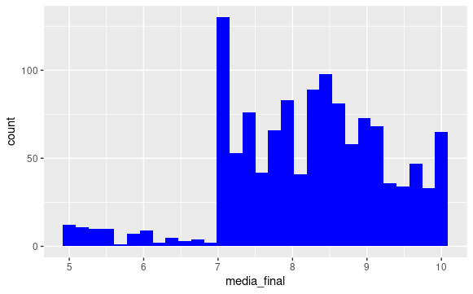

# Analisando LOAC

1. Importamos os dados de LOAC e OAC
    1. Intervalo de tempo que estamos analisando: 2003 - 2020
2. Contabilizou a quantidade de aprovados e reprovados em LOAC:
    1. Aprovados: 1252
    2. Reprovados: 142 (10.19%)
3. Contabilizou a quantidade de aprovados e reprovados OAC:
    1. Aprovados: 1276
    2. Reprovados: 95(6.93%)
4. Contabilizou a quantidade de evasão dos alunos:
    1. Evasão: 51
    2. Tipo de evasão mais frequente: Reprovou 3 vezes mesma disciplina (depois de reingresso)
    3. Temos um parâmetro pra saber se é alta ou baixa?
        1. Comparamos com OAC que apontou 47 alunos evadidos, onde os tipos mais comuns foram reprovação 3 vezes na mesma disciplina e cancelamento por abandono.
    4. A gente pode tirar o que disso?
        1. Comparando com OAC a taxa de evasão é bem maior apesar do numero de evadidos ser bem próximos, indicando que há muita tentativa reingresso no período da disciplina mas ainda assim de 142 reprovados, a metade 71 conseguiu ser aprovado eventualmente.
5. Avaliação das notas gerais de LOAC
    - Aprovados:
        
        
        
    - Reprovados:
        
        
        
6. Avaliação das notas gerais de OAC
    - Aprovados:
        
        
        
    - Reprovados:
        
        
        
7. Comparar as notas de OAC com LOAC para ver se o método de avaliação implica nas notas tanto de reprovados como aprovados.
    
    